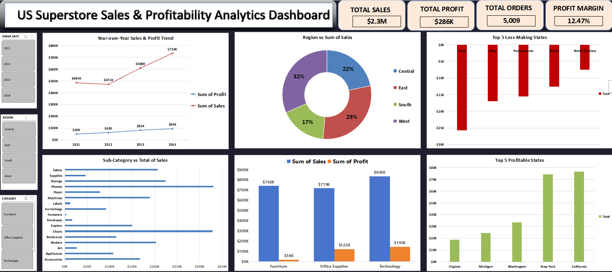

# US Superstore Sales & Profitability Analytics Dashboard

## 📌 Executive Overview
An interactive executive-level Data Analytics Dashboard engineered using **Advanced Excel**, **Power Query**, and **Data Modeling**. This project evaluates **$2.3M+ in retail revenue** across **5,009 unique orders** (9,994 transaction line items) and **37,873 units sold** from the US Superstore dataset. 

The primary objective of this dashboard is to isolate key business revenue drivers, identify geographic profit leakages, and monitor category-level performance metrics for executive decision-making.

---

## 📸 Interactive Dashboard View

---

## 🎯 Verified Business Metrics & Insights Identified
- **Total Revenue Generated:** `$2.297M ($2.3M)` across all product categories.
- **Total Net Profit:** `$286,397 ($286K)` realized globally.
- **Total Unique Orders:** `5,009` (Aggregated via `Distinct Count` on `Order ID` in Excel Data Model to prevent row-count inflation).
- **Overall Profit Margin:** `12.47%`.
- **Top Revenue Category:** `Technology` generated the highest revenue (**$836K sales**, **$145.4K profit**), followed by `Furniture` ($742K sales) and `Office Supplies` ($719K sales).
- **Top Profitable States:** `California` ($76.4K profit) and `New York` ($74K profit) led global profitability.
- **Critical Profit Leakage Territories:** `Texas` (-$25.7K loss) and `Ohio` (-$17K loss) were isolated as top profit-draining markets requiring immediate pricing restructuring and discount capping.

---

## 🛠️ Technical Stack & Implementation Steps

### 1. Data Cleaning & Automated ETL (Power Query)
- Structured raw transaction logs, handling missing values, standardizing datetime fields (`Order Date`, `Ship Date`), and parsing geographic categories.
- Formatted clean data schemas to ensure seamless Pivot Table aggregation.

### 2. Data Modeling & Advanced Aggregations
- Loaded normalized raw tables directly into the **Excel Data Model**.
- Leveraged Data Model metrics to compute distinct calculations, ensuring primary key `Order ID` reflects exact unique transaction counts (`5,009`).

### 3. Visual Formatting & Scalability Logic
- Implemented standard custom conditional formatting strings for dynamic numerical scaling (`$K` for thousands, `$M` for millions) to maintain visual clarity:
  `[>=1000000]$#,##0.0,,"M";[>=1000]$#,##0,"K";$#,##0`
- Formatted visual hierarchy: Applied conditional **Red Fill** for profit-draining states vs. **Green Fill** for high-margin states to draw immediate analytical focus.

### 4. Interactivity & Slicer Mapping
- Integrated dynamic multi-attribute Slicers (`Order Date Year`, `Region`, `Category`) linked across all Pivot Charts for slice-and-dice data exploration.

---

## 📂 Repository Layout
- `Dashboard_Overview.png` — High-resolution screenshot export of the dashboard UI
- `Superstore_Dataset.xlsx` — Source transactional dataset (9,994 rows)
- `SUPERSTORE SALES DATASET DASHBOARD.xlsx` — Main Excel workbook with Data Model, Power Query & Pivots

---

## 👤 Author
- **Name:** Shrikant Pedde   
- **GitHub:** [@shrikantpedde](https://github.com/shrikantpedde)  
- **LinkedIn:** [Shrikant Pedde](https://linkedin.com/in/shrikant-pedde-535b24320/)
